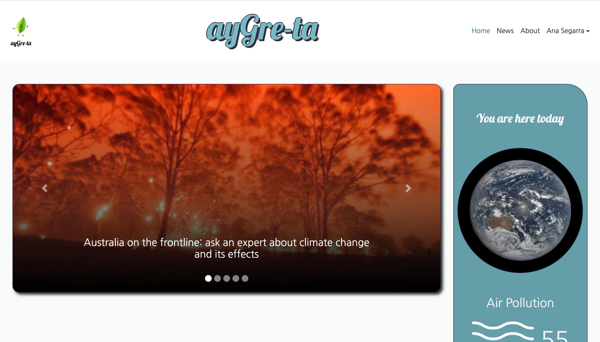

# ayGre-ta
> Social network for climate change warrios

Responsive app that shows the latest news on climate change in which users can interact with each other 

## Demo

Live version [https://aygre-ta.herokuapp.com/](https://aygre-ta.herokuapp.com/)

## Features
* Main page shows a carousel with five of the latest news as well as some insightful information about the environment
* News page displays up to a hundred of the latest news on climate changes, environment, global warming...
* Users can sign up and login both using Facebook or providing username and password 
* When logged in, users can: 
  - Favorite/unfavorite news using the leaf button, which will be saved in their favorite page
  - Look for user's to follow using search bar
  - Open modal to check their followers and following 
  - Create post and like post from the people they are following by cliking the victory button 

## Installing
In order to run this project locally do the following:

1. Clone the project
2. Run `npm install` to install all the dependencies
3. Change [.envExample](https://github.com/Iron-berg/ayGre-ta/blob/master/.envExample) file name to .env and paste the required environment variables in the corresponding field 
4. Run `npm run dev` to launch the application and access it at localhost:port

## Contributing
If you wish to contribute to this project, you may add yourself to [CONTRIBUTING.md](https://github.com/Iron-berg/ayGre-ta/blob/master/CONTRIBUTING.md)

## License
Please refer to [LICENSE.md](https://github.com/Iron-berg/ayGre-ta/blob/master/LICENSE.md)

## Team
<table>
<tr><td align="center"><a href="https://github.com/anaSegarra"> <b>Ana Segarra</b></a> 
<td align="center"><a href="https://github.com/joseanher81"> <b>Jose Ángel Hernández</b></a> 
</table>
